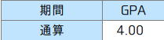
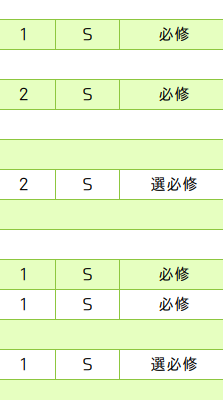
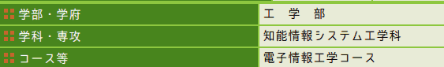

My GPA is 4.0
======
# Overview
  
  

# Usage

- chrome/chromium(win/mac/linux)

# Install

```git clone https://github.com/tuat-yate/My-GPA-is-4.0```  
or  
google drive(@st.tuat.ac.jp only)➔[https://drive.google.com/open?id=1Xb4Z9gw1R4IHKvhHFZOjFe-k3Iv3D694](https://drive.google.com/open?id=1Xb4Z9gw1R4IHKvhHFZOjFe-k3Iv3D694)

1. [chrome://extensions/](hrome://extensions/)にアクセス．
1. 「デベロッパーモード」をオンにする．
1. 「パッケージ化されていない拡張機能を読み込む」をクリック．
1. clone/downloadしたフォルダを指定．

正しく動作しない場合はchrome右上のtatマークをクリックしてみてください．
